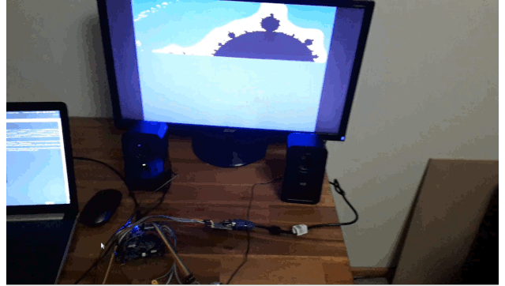

SLURM16 SoC - SLightly Useful RISC Machine, 16 bit, system-on-chip
==================================================================

Video console system-on-chip made for the iCE40 UP5K FPGA.

64k x 16bit memory, shared between CPU and gfx / flash DMA. Split into 4 banks so CPU, GPU, and flash dma can access the (single port) memory banks simultaneously.

Peripherals are on an IO bus, which is separate from the main memory space, so no memory space is wasted.

Peripherals include UART, GFX core (sprites with collision detection, tiled background), FIFO-based audio core, SPI flash DMAC, GPIO, RGB LED driver, debug trace port (simulation only).

Interrupts: Vblank, Hblank, Audio interrupt, SPI flash DMA complete. 

SLURM16 CPU
===========

SLURM16 is a 16 bit core, with 16x 16-bit registers. R0 = always zero, R15 = link 
register (LR), R14 = interrupt link register (ILR), R13 = stack pointer (SP), R1-R12 are general purpose. Although unintended, the architecture bears a strong resemblance to
Jan Gray's XR16 RISC machine.

Five stage pipeline. 

Instruction cache to improve performance and allow code to execute simultaneously with memory accesses.

Memory addressed are byte addresses. No exception for unaligned access, instead memory address is masked on word transfers including instruction fetches. Memory may be accessed with byte granularity,
so there can be a "char" type in C.

C compiler provided (for now) by retargeting lcc, as per Jan gray's XR16. However, it is hoped to replace lcc with a custom, optimising C compiler supporting C11 at a later point in time.

Interrupt Vectors
=================

Vector table is located at address 0x0000, which is in boot memory, but can be reprogrammed using an IO port.
Each vector is two 16 bit words, enough to hold an imm instruction and a branch instruction, to jump to a handler. The CPU
will simply transfer execution to the vector address on an interrupt.

| Vector| Vector offset| Purpose|
|--------|----------------|----------------|
|   0    |      0x0       |   Reset        |
|   1    |      0x4       |   Hsync        |
|   2    |      0x8       |   Vsync        |
|   3    |      0xc       |   Audio        |
|   4    |      0x10      |   SPI flash DMA|
|   5-15 |      0x14      |   Reserved     |	

   
